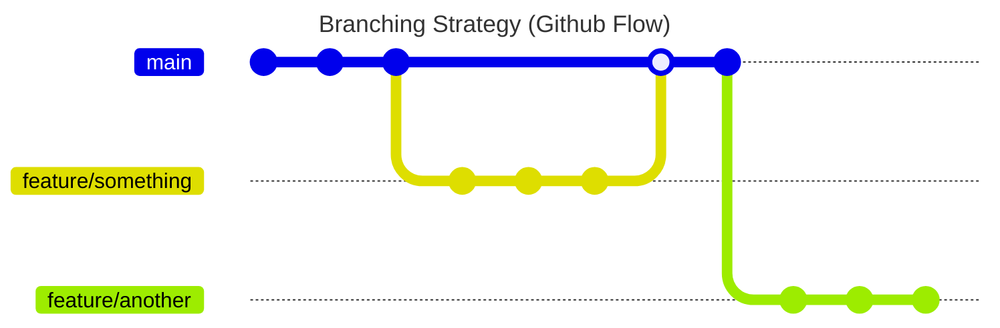

# NFC-OJI
NFC-OJI represents Organizer, Judge, and Interpreter, embodying the app's role in structuring, assessing, and utilizing NFC tags effectively.

## Development Strategies
### Branching
<!-- 
本リポジトリは、Github Flow を採用しています。
- main: リリース可能な状態のコードが置かれるブランチ
- feature/x: x という機能を追加するためのブランチ
 -->
This repository adopts the Github Flow. 
- `main`: Branch for release-ready code
- `feature/x`: Branch for adding features named x

### Commit Message
<!--
コミットメッセージは、以下のフォーマットを採用しています。
- feat: 新機能の追加
- fix: バグ修正
- docs: ドキュメントのみ変更
- style: コードの意味に影響を与えない変更（空白、フォーマット、セミコロンの欠落など）
- refactor: バグ修正も機能追加も行わないコードの変更
- perf: パフォーマンスを向上させるコードの変更
- test: 不足しているテストの追加、既存テストの修正
- chore: ビルドプロセス、補助ツール、ライブラリの変更
- ci: CI の設定変更
- revert: 前のコミットを取り消す
-->
This repository adopts the following commit message format:
- `feat`: Add new feature
- `fix`: Fix bug
- `docs`: Change documentation only
- `style`: Change code without affecting its meaning (e.g., whitespace, formatting, missing semicolons)
- `refactor`: Change code without fixing bugs or adding features
- `perf`: Improve performance
- `test`: Add missing tests or fix existing tests
- `chore`: Change build process, auxiliary tools, or libraries
- `ci`: Change CI configuration
- `revert`: Revert previous commit

### Release Versioning
<!--
セマンティックバージョニングを採用しています。
バージョン番号は、以下のフォーマットを採用しています。
- major: 互換性のない変更
- minor: 互換性のある変更で新機能が追加された場合
- patch: 互換性のある変更でバグが修正された場合
-->
This repository adopts Semantic Versioning. The version number follows the format below:
- `major`: Incompatible changes
- `minor`: Compatible changes with added features
- `patch`: Compatible changes with fixed bugs

> [!Note]
> For example, if the current version is `1.2.3`, the next version will be:
> - `2.0.0` for a major change
> - `1.3.0` for a minor change with added features
> - `1.2.4` for a patch change with fixed bugs

## Issue Management
### Issue Types
<!--
Issue は、以下の種類に分類されます。
- Feature: 新機能の追加
- Bug: バグの修正
- Documentation: ドキュメントの変更
- Refactor: リファクタリング
- Performance: パフォーマンス向上
- Test: テストの追加
- Chore: その他
-->

Issues are classified into the following types:
- `Feature`: Add new feature
- `Bug`: Fix bug
- `Documentation`: Change documentation
- `Refactor`: Refactor code
- `Performance`: Improve performance
- `Test`: Add tests
- `Chore`: Others

### Issue Labels
<!--
Issue には、以下のラベルが付与されます。
- bug: バグの修正
- enhancement: 機能追加
- documentation: ドキュメントの変更
- duplicate: 重複
- invalid: 無効
- question: 質問
- wontfix: 対応しない
- help wanted: ヘルプが必要
- good first issue: 初心者向け
- priority: 優先度
  - high: 高
  - medium: 中
  - low: 低
-->

Issues are labeled with the following labels:
- `bug`: Fix bug
- `enhancement`: Add new feature
- `documentation`: Change documentation
- `duplicate`: Duplicate
- `invalid`: Invalid
- `question`: Question
- `wontfix`: Won't fix
- `help wanted`: Help wanted
- `good first issue`: Good first issue
- `priority`: Priority
    - `high`: High
    - `medium`: Medium
    - `low`: Low
- `type`: Type
- `status`: Status

> [!Note] 
> For example, if an issue is a bug with high priority, it will be labeled with `bug` and `priority: high`.
> If an issue is a feature request with low priority, it will be labeled with `enhancement` and `priority: low`.

### Issue Templates
<!--
Issue には、以下のテンプレートが用意されています。
- Feature request: 新機能の追加
- Bug report: バグの報告
- Documentation: ドキュメントの変更
- Refactor: リファクタリング
- Performance: パフォーマンス向上
- Test: テストの追加
- Chore: その他
-->

The following templates are available for issues:
- `Feature request`: Add new feature
- `Bug report`: Report bug
- `Documentation`: Change documentation
- `Refactor`: Refactor code
- `Performance`: Improve performance
- `Test`: Add tests
- `Chore`: Others

## License
This project is licensed under the MIT License
- see the [LICENSE](LICENSE) file for details.

## Acknowledgments
- [Flutter](https://flutter.dev/)
